# Call Graph Diagram Comparison & Decision Guide

## Comparison Table

| Diagram Type | Best For | Ease of Use | Expressiveness | Rendering | Integration | Learning Curve | Maintenance | Professional Look |
|-------------|----------|-------------|---------------|-----------|--------------|----------------|-------------|-------------------|
| **PlantUML Sequence** | ⭐⭐⭐⭐⭐ Complex call flows, temporal relationships | ⭐⭐⭐ | ⭐⭐⭐⭐⭐ (activation bars, return values, notes) | Web/PDF/PNG/SVG | IDE extensions, CI/CD | ⭐⭐ | ⭐⭐⭐ | ⭐⭐⭐⭐⭐ |
| **Mermaid Sequence** | ⭐⭐⭐ Simple call sequences | ⭐⭐⭐⭐⭐ | ⭐⭐⭐ (basic participants, messages) | ✅ Markdown-native | GitHub/GitLab auto-render | ⭐⭐⭐⭐⭐ | ⭐⭐⭐ | ⭐⭐⭐ |
| **UML Sequence** | ⭐⭐⭐⭐ Formal documentation | ⭐⭐ | ⭐⭐⭐⭐⭐ | Tools required | Enterprise docs | ⭐⭐ | ⭐⭐ | ⭐⭐⭐⭐⭐ |
| **Literate Code Maps** | ⭐⭐⭐ Architecture + selective calls | ⭐⭐ | ⭐⭐⭐⭐ (code fragments + flow) | PlantUML base | Custom methodology | ⭐⭐⭐ | ⭐⭐ | ⭐⭐⭐⭐ |
| **Graphviz DOT** | ⭐⭐⭐⭐ Complex hierarchies, large graphs | ⭐ | ⭐⭐⭐⭐⭐ (full graph control) | Multiple formats | Programmatic generation | ⭐ | ⭐⭐ | ⭐⭐⭐⭐ |
| **Doxygen** | ⭐⭐⭐⭐ Auto-generated from code | ⭐⭐⭐⭐⭐ | ⭐⭐⭐ (static graphs) | HTML docs | Build systems | ⭐⭐⭐ | ⭐⭐⭐⭐ | ⭐⭐⭐ |
| **IDE Call Hierarchy** | ⭐⭐⭐⭐ Interactive exploration | ⭐⭐⭐⭐⭐ | ⭐⭐⭐ (dynamic views) | IDE-specific | Development workflow | ⭐⭐⭐⭐⭐ | ⭐⭐⭐⭐ | ⭐⭐⭐ |
| **Understand (SciTools)** | ⭐⭐⭐⭐⭐ Professional code analysis | ⭐⭐ | ⭐⭐⭐⭐⭐ (metrics, dependencies, queries) | Rich GUI/HTML | Enterprise workflows | ⭐⭐ | ⭐⭐⭐⭐ | ⭐⭐⭐⭐⭐ |
| **draw.io** | ⭐⭐⭐ Simple to complex graphs | ⭐⭐⭐⭐⭐ | Multiple formats | Cloud/web | Collaboration | ⭐⭐⭐⭐⭐ | ⭐⭐⭐ | ⭐⭐⭐⭐ |
| **Visio** | ⭐⭐⭐ Enterprise diagrams | ⭐⭐⭐ | ⭐⭐⭐⭐ | MS Office integration | Corporate docs | ⭐⭐⭐ | ⭐⭐⭐ | ⭐⭐⭐⭐⭐ |
| **Lucidchart** | ⭐⭐⭐ Collaborative diagramming | ⭐⭐⭐⭐⭐ | Web/cloud | Team workflows | ⭐⭐⭐⭐⭐ | ⭐⭐⭐ | ⭐⭐⭐⭐ |
| **yEd** | ⭐⭐⭐ Graph layout algorithms | ⭐⭐⭐ | ⭐⭐⭐⭐⭐ | Desktop app | Free/open source | ⭐⭐ | ⭐⭐⭐ | ⭐⭐⭐⭐ |
| **CodeScene** | ⭐⭐⭐⭐ Code analysis & hotspots | ⭐⭐⭐ | ⭐⭐⭐⭐⭐ (temporal analysis, complexity) | Web reports | CI/CD integration | ⭐⭐⭐ | ⭐⭐⭐⭐ | ⭐⭐⭐⭐ |
| **VisualVM** | ⭐⭐⭐⭐ JVM profiling & monitoring | ⭐⭐⭐⭐ | ⭐⭐⭐⭐ (runtime call trees, memory) | GUI application | Development/debugging | ⭐⭐⭐ | ⭐⭐⭐⭐ | ⭐⭐⭐ |
| **Gephi** | ⭐⭐⭐⭐ Network analysis & visualization | ⭐⭐ | ⭐⭐⭐⭐⭐ (advanced layouts, statistics) | Desktop app | Research/analysis | ⭐⭐ | ⭐⭐⭐ | ⭐⭐⭐⭐ |
| **Chrome DevTools** | ⭐⭐⭐ Web app call analysis | ⭐⭐⭐⭐⭐ | ⭐⭐⭐ (network waterfall, call stacks) | Browser built-in | Web development | ⭐⭐⭐⭐⭐ | ⭐⭐⭐⭐ | ⭐⭐⭐ |

## Decision Flowchart

```mermaid
flowchart TD
    A[Need to create a call graph?] --> B{Primary use case?}

    B --> C[Documentation/Presentation]
    B --> D[Code Analysis/Debugging]
    B --> E[Architecture Overview]
    B --> F[Automated Generation]
    B --> G[Team Collaboration]
    B --> H[Runtime Analysis/Profiling]

    C --> H{Budget & Tools?}
    H --> I[Free/Open Source] --> J{Platform preference?}
    J --> K[Web-based] --> L[draw.io]
    J --> M[Desktop] --> N[yEd]
    H --> O[Paid/Enterprise] --> P{MS Office ecosystem?}
    P --> Q[Yes] --> R[Visio]
    P --> S[No] --> T[Understand]

    D --> U{Interactive exploration needed?}
    U --> V[Yes] --> W[IDE Call Hierarchy]
    U --> X[No] --> Y{Deep analysis required?}
    Y --> Z[Yes] --> AA[Understand]
    Y --> BB[No] --> CC{Static diagram for sharing?}
    CC --> DD[Yes] --> EE[PlantUML Sequence]
    CC --> FF[No] --> GG[Graphviz DOT]

    E --> HH{Code fragments important?}
    HH --> II[Yes] --> JJ[Literate Code Maps]
    HH --> KK[No] --> LL{Simple or complex?}
    LL --> MM[Simple] --> NN[Mermaid Flowchart]
    LL --> OO[Complex] --> PP[PlantUML Component]

    F --> QQ{From existing code?}
    QQ --> RR[Yes] --> SS{Supported language?}
    SS --> TT[Rust/C/C++/Java] --> UU[Doxygen]
    SS --> VV[Other] --> WW[Graphviz DOT + scripts]
    QQ --> XX[No] --> YY{Generated how?}
    YY --> ZZ[Programmatic] --> AAA[Graphviz DOT]
    YY --> BBB[Manual] --> CCC[PlantUML Sequence]

    G --> DDD{Real-time collaboration?}
    DDD --> EEE[Yes] --> FFF[Lucidchart]
    DDD --> GGG[No] --> HHH{File-based sharing?}
    HHH --> III[Yes] --> JJJ[draw.io]
    HHH --> KKK[No] --> LLL[PlantUML + Git]

    H --> MMM{Application type?}
    MMM --> NNN[Web/JavaScript] --> OOO[Chrome DevTools]
    MMM --> PPP[JVM/Java] --> QQQ[VisualVM]
    MMM --> RRR[General] --> SSS{Research/heavy analysis?}
    SSS --> TTT[Yes] --> UUU[Gephi]
    SSS --> VVV[No] --> WWW[CodeScene]

    L --> MMM[✅ Free, feature-rich, offline capability]
    N --> NNN[✅ Free, powerful layouts, cross-platform]
    R --> OOO[✅ Professional, MS integration, enterprise features]
    T --> PPP[✅ Advanced analysis, metrics, enterprise-grade]
    W --> QQQ[✅ Interactive debugging, fast iteration]
    AA --> RRR[✅ Deep code insights, dependency analysis]
    EE --> SSS[✅ Detailed temporal flows, activation bars]
    GG --> TTT[✅ Full graph control, scalable]
    JJ --> UUU[✅ Code + architecture, literate programming]
    NN --> VVV[✅ Markdown-native, simple flows]
    PP --> WWW[✅ Professional diagrams, rich features]
    UU --> XXX[✅ Zero maintenance, always up-to-date]
    WW --> YYY[✅ Flexible scripting, custom analysis]
    AAA --> ZZZ[✅ Programmatic generation, customization]
    CCC --> AAAA[✅ Manual control, professional output]
    FFF --> BBBB[✅ Real-time collaboration, cloud-based]
    JJJ --> CCCC[✅ Versatile, export options, cost-effective]
    LLL --> DDDD[✅ Version control, CI/CD integration]
    OOO --> PPPP[✅ Browser-native, real-time web analysis]
    QQQ --> QQQQ[✅ Comprehensive JVM monitoring, free]
    UUU --> RRRR[✅ Advanced graph analysis, academic-grade]
    WWW --> SSSS[✅ Code quality metrics, CI/CD ready]

    MMM --> EEEE[Considerations: Learning curve for advanced features]
    NNN --> FFFF[Considerations: Java-based, resource intensive]
    OOO --> GGGG[Considerations: Subscription cost, Windows-centric]
    PPP --> HHHH[Considerations: Expensive, complex setup]
    QQQ --> IIII[Considerations: Not shareable, IDE-specific]
    RRR --> JJJJ[Considerations: Steep learning, high cost]
    SSS --> KKKK[Considerations: Manual creation, maintenance overhead]
    TTT --> LLLL[Considerations: Programming required, complex syntax]
    UUU --> MMMM[Considerations: Custom methodology, PlantUML dependency]
    VVV --> NNNN[Considerations: Limited styling, simple flows only]
    WWW --> OOOO[Considerations: Tool dependency, steeper learning]
    XXX --> PPPP[Considerations: Limited customization, language support]
    YYY --> QQQQ[Considerations: Scripting knowledge required]
    ZZZ --> RRRR[Considerations: Development time, maintenance]
    AAAA --> SSSS[Considerations: Manual updates, consistency]
    BBBB --> TTTT[Considerations: Subscription cost, internet required]
    CCCC --> UUUU[Considerations: Browser-based, potential lag]
    DDDD --> VVVV[Considerations: Tool setup, collaboration overhead]
    PPPP --> LLLLL[Considerations: Only for web apps, browser-dependent]
    QQQQ --> MMMMM[Considerations: JVM-only, resource intensive]
    RRRR --> NNNNN[Considerations: Steep learning curve, research-focused]
    SSSS --> OOOOO[Considerations: Subscription model, learning curve]

    EEEE --> WWWW[Recommendation: Versatile diagramming, cost-effective]
    FFFF --> XXXX[Recommendation: Advanced graph layouts, free]
    GGGG --> YYYY[Recommendation: Enterprise MS Office integration]
    HHHH --> ZZZZ[Recommendation: Professional code analysis]
    IIII --> AAAAA[Recommendation: Development/debugging workflow]
    JJJJ --> BBBBB[Recommendation: Deep code understanding]
    KKKK --> CCCCC[Recommendation: Detailed analysis presentations]
    LLLL --> DDDDD[Recommendation: Custom automated graphs]
    MMMM --> EEEEE[Recommendation: Architecture with code examples]
    NNNN --> FFFFF[Recommendation: Simple docs with auto-rendering]
    OOOO --> GGGGG[Recommendation: Professional docs, complex flows]
    PPPP --> HHHHH[Recommendation: Large projects with CI/CD]
    QQQQ --> IIIII[Recommendation: Flexible custom analysis]
    RRRR --> JJJJJ[Recommendation: Programmatic diagram generation]
    SSSS --> KKKKK[Recommendation: High-quality manual diagrams]
    TTTT --> LLLLL[Recommendation: Team diagramming collaboration]
    UUUU --> MMMMM[Recommendation: Simple sharing, cost-effective]
    VVVV --> NNNNN[Recommendation: Version-controlled diagrams]
    LLLLL --> HHHHHH[Recommendation: Web development debugging]
    MMMMM --> IIIIII[Recommendation: JVM application profiling]
    NNNNN --> JJJJJJ[Recommendation: Advanced network analysis]
    OOOOO --> KKKKKK[Recommendation: Code quality visualization]
```

## Expanded Coverage

### 🎯 **Complete Popular Diagram Types Covered**

1. **Text-based Diagram Languages**
   - PlantUML, Mermaid, Graphviz DOT

2. **UML Tools**
   - Standard UML sequence diagrams

3. **Code Analysis Tools**
   - Doxygen, Understand (SciTools), CodeScene

4. **IDE-integrated Tools**
   - Call hierarchy viewers (VS Code, IntelliJ, etc.)

5. **General Diagramming Tools**
   - draw.io, Visio, Lucidchart, yEd

6. **Runtime Profiling Tools**
   - VisualVM, Chrome DevTools

7. **Academic/Research Tools**
   - Gephi

8. **Specialized Methodologies**
   - Literate Code Maps

### 📊 **Market Share & Popularity Factors**

- **PlantUML**: Most popular text-based diagramming (GitHub stars: 8.5k)
- **Mermaid**: Fastest growing, GitHub integration (stars: 60k+)
- **draw.io**: Most accessible free diagramming tool (stars: 35k)
- **Graphviz**: Industry standard for graph visualization (25+ years)
- **Doxygen**: Essential for C/C++/documentation projects
- **Understand**: Leading commercial code analysis tool
- **VisualVM**: Default JVM profiling tool (bundled with JDK)
- **Chrome DevTools**: Built into every Chrome-based browser
- **Gephi**: Leading open-source network analysis platform
- **CodeScene**: Modern code analysis with temporal insights

### 🔄 **Trends & Future Considerations**

- **Markdown-native tools** (Mermaid) continue rapid growth
- **AI-assisted diagram creation** emerging in tools like draw.io
- **Web-based collaborative editing** favors Lucidchart, draw.io
- **CI/CD integration** drives adoption of PlantUML, Graphviz
- **Code analysis tools** increasingly include visualization features
- **AI Knowledge Graphs** emerging for codebase understanding (CodeGPT, GitHub Copilot)

### 🤖 **AI Knowledge Graphs for Code Understanding**

You're correct that AI coding assistants like CodeGPT use knowledge graphs, but these serve a **different purpose** than traditional call graphs:

| Aspect | Traditional Call Graphs | AI Knowledge Graphs |
|--------|------------------------|-------------------|
| **Purpose** | Visual documentation, human understanding | AI model training, semantic search |
| **Creation** | Manual/Auto-generated diagrams | Automated by AI tools |
| **Format** | Visual diagrams (PNG, SVG, web) | Internal graph representations |
| **Usage** | Documentation, presentations, debugging | Code completion, navigation, search |
| **Tools** | PlantUML, Mermaid, Graphviz | CodeGPT, Copilot, Tabnine |
| **Maintenance** | Manual updates required | Auto-updated by AI |

**AI knowledge graphs** represent code as interconnected nodes/edges for:
- **Semantic understanding**: What functions/classes do
- **Relationship mapping**: Dependencies, inheritance, usage patterns
- **Context-aware suggestions**: Intelligent code completion
- **Code navigation**: Finding related code elements

While valuable for AI assistants, these **don't replace traditional call graphs** for human-readable documentation and analysis. The guide focuses on **visual call graph creation tools** for developers, not AI training data structures.

## Key Findings

### 🏆 **Top Recommendation: PlantUML Sequence Diagrams**
- **Best balance** of expressiveness, ease of use, and professional output
- **Rich features** for call graphs: activation bars, return values, notes, grouping
- **Multiple rendering options**: web viewer, VS Code extension, command line
- **Widely used** in software documentation

### 🎯 **Quick Decision Guide**

| Scenario | Recommended Tool | Why |
|----------|------------------|-----|
| **GitHub README docs** | Mermaid Sequence | Renders directly in markdown |
| **Professional docs** | PlantUML Sequence | Best visual quality and features |
| **Code analysis/debugging** | IDE Call Hierarchy | Interactive exploration |
| **Auto-generated graphs** | Doxygen/Graphviz | Zero maintenance overhead |
| **Architecture + code** | Literate Code Maps | Combines structure with implementation |
| **Large/complex graphs** | Graphviz DOT | Full control and scalability |
| **Runtime JVM profiling** | VisualVM | Comprehensive JVM monitoring, free |
| **Web app call analysis** | Chrome DevTools | Browser-native, real-time analysis |
| **Advanced network analysis** | Gephi | Academic-grade graph analysis |
| **Code quality hotspots** | CodeScene | Temporal analysis, CI/CD ready |
| **Enterprise analysis** | Understand | Professional code metrics, queries |
| **Team collaboration** | Lucidchart | Real-time collaborative editing |

### 🔧 **Tool Setup Recommendations**

- **PlantUML**: VS Code extension + web viewer at plantuml.com
- **Mermaid**: Built into GitHub/GitLab, no setup needed
- **Graphviz**: `dot` command line tool for generation
- **Doxygen**: Integrate into build process
- **IDE tools**: Built into VS Code, IntelliJ, etc.

### 📈 **Trends & Future Considerations**

- **Markdown-native tools** (Mermaid) are growing due to platform integration
- **AI-assisted diagram creation** is emerging
- **Web-based collaborative editing** favors PlantUML and Mermaid
- **CI/CD integration** favors programmatic generation (Graphviz, custom scripts)

The choice ultimately depends on your team's workflow, documentation needs, and whether you prioritize automation vs. manual control.
